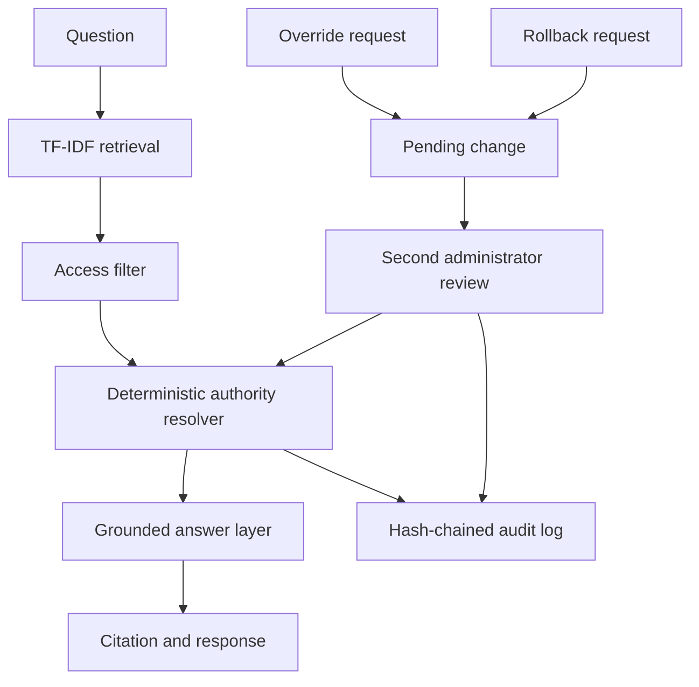

# Architecture

Retrieval finds relevant documents; it does not select authority. The resolver
uses structured status, approval, ownership, recency, version, and evidence
facts. The answer layer receives only the selected version content.

Override and rollback requests are pending until a different administrator
approves them. Audit events include a SHA-256 chain link so tampering is
detectable through `GET /api/audit/verify`.