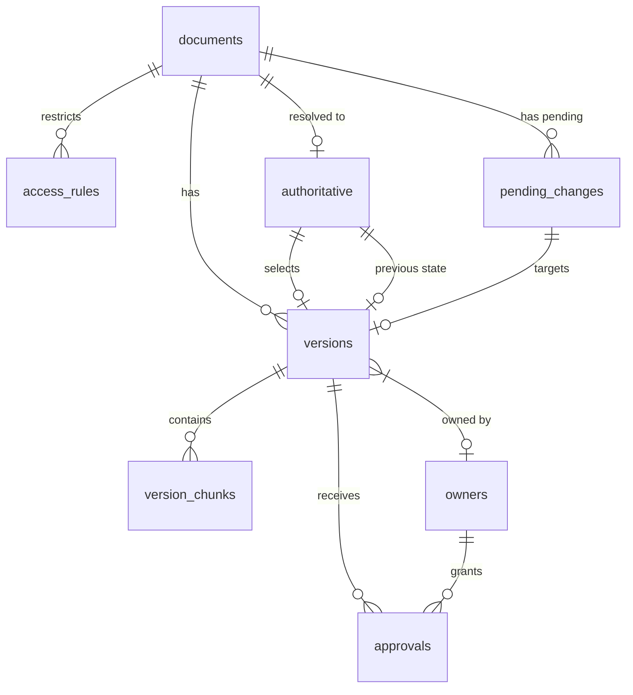

# Database Schema

The Authoritative Architecture Decision Resolver uses a SQLite database with the following schema. The SQL schema is designed to be fully ANSI standard so it can easily migrate to PostgreSQL.

## Entity Relationship Diagram

## Tables

### `users`
System users for authentication.
* `id` (INTEGER): Primary key.
* `username` (TEXT): Unique username.
* `password_hash` (TEXT): bcrypt hash of password.
* `role` (TEXT): 'ADMIN', 'ARCHITECT', 'ENGINEER', or 'VIEWER'.

### `owners`
Authorities capable of approving document versions.
* `id` (INTEGER): Primary key.
* `name` (TEXT): Owner/board name.
* `authority_level` (REAL): Numerical ranking of authority (higher overrides lower).

### `documents`
The high-level architecture decisions or records.
* `id` (TEXT): Primary key (e.g., 'doc-1').
* `title` (TEXT): Human-readable title.
* `category` (TEXT): Type/category of document.
* `created_at` (TEXT): ISO-8601 timestamp.

### `versions`
Specific revisions of a document.
* `id` (TEXT): Primary key (e.g., 'doc-1-v2').
* `document_id` (TEXT): Foreign key to `documents`.
* `version_number` (INTEGER): Sequential version number.
* `content` (TEXT): Full document text.
* `created_date` (TEXT): Date this version was authored.
* `modified_date` (TEXT): Date this version was last changed.
* `status` (TEXT): 'APPROVED', 'DRAFT', 'REJECTED', 'SUPERSEDED', 'ARCHIVED', or 'PENDING_REVIEW'.
* `content_hash` (TEXT): Hash of the content.
* `owner_id` (INTEGER): Foreign key to `owners` (the primary owner).
* `citations_json` (TEXT): Serialized citations mapping to chunks.

### `version_chunks`
Text chunks for retrieval and citation.
* `id` (INTEGER): Primary key.
* `version_id` (TEXT): Foreign key to `versions`.
* `chunk_id` (TEXT): Unique chunk identifier.
* `section` (TEXT): Section heading or number.
* `page` (INTEGER): Page number.
* `source_text` (TEXT): Text contents of the chunk.

### `approvals`
Approval decisions logged by owners against a version.
* `id` (INTEGER): Primary key.
* `version_id` (TEXT): Foreign key to `versions`.
* `approver_owner_id` (INTEGER): Foreign key to `owners`.
* `decision` (TEXT): 'APPROVED', 'REJECTED', or 'PENDING_REVIEW'.
* `date` (TEXT): ISO-8601 timestamp.
* `reason` (TEXT): Justification.

### `access_rules`
Permissions rules for document access.
* `id` (INTEGER): Primary key.
* `document_id` (TEXT): Foreign key to `documents`.
* `role` (TEXT): Target user role.
* `allowed` (INTEGER): 1 (true) or 0 (false).

### `authoritative`
The currently resolved "winning" version of a document.
* `document_id` (TEXT): Foreign key to `documents` (Primary Key).
* `version_id` (TEXT): Foreign key to `versions`.
* `score` (REAL): The calculated authority score.
* `breakdown_json` (TEXT): Explanation of how the score was calculated.
* `is_override` (INTEGER): 1 if set manually, 0 if auto-resolved.
* `override_reason` (TEXT): Justification if manual.
* `override_by` (TEXT): Admin who made the override.
* `previous_version_id` (TEXT): For rollbacks, foreign key to `versions`.
* `previous_score` (REAL): Score of the previous version.
* `updated_at` (TEXT): ISO-8601 timestamp.

### `audit_log`
Immutable record of system events.
* `event_id` (INTEGER): Primary key.
* `timestamp` (TEXT): ISO-8601 timestamp.
* `user` (TEXT): Username responsible.
* `action` (TEXT): Type of action.
* `document_id` (TEXT): Associated document (optional).
* `version_id` (TEXT): Associated version (optional).
* `previous_value` (TEXT): State before change.
* `new_value` (TEXT): State after change.
* `reason` (TEXT): Provided justification.
* `metadata_json` (TEXT): Extra event data.
* `prev_hash` (TEXT): Cryptographic hash of the previous event.
* `event_hash` (TEXT): Cryptographic hash of this event.

### `pending_changes`
Manual changes (overrides/rollbacks) waiting for secondary review.
* `id` (INTEGER): Primary key.
* `action` (TEXT): 'OVERRIDE' or 'ROLLBACK'.
* `document_id` (TEXT): Target document.
* `version_id` (TEXT): Target version (optional).
* `requested_by` (TEXT): Requester username.
* `reason` (TEXT): Justification.
* `status` (TEXT): 'PENDING', 'APPROVED', or 'REJECTED'.
* `reviewed_by` (TEXT): Reviewer username.
* `created_at` (TEXT): ISO-8601 timestamp.
* `reviewed_at` (TEXT): ISO-8601 timestamp.

### `feedback`
User feedback from Ask AI.
* `id` (INTEGER): Primary key.
* `query` (TEXT): Question asked.
* `answer_clear` (INTEGER): 1-5 rating.
* `source_clear` (INTEGER): 1-5 rating.
* `citation_useful` (INTEGER): 1-5 rating.
* `increased_trust` (INTEGER): 1-5 rating.
* `would_use` (INTEGER): 1-5 rating.
* `comment` (TEXT): Free-text comment.
* `created_at` (TEXT): ISO-8601 timestamp.

### `eval_queries`
Planted evaluation ground truth.
* `id` (INTEGER): Primary key.
* `query` (TEXT): Query text.
* `expected_document_id` (TEXT): Target document.
* `expected_version_id` (TEXT): Target version.
* `expected_answer` (TEXT): Required substring.
* `expected_citation` (TEXT): Required citation chunk.
* `category` (TEXT): Test category.
* `scenario_type` (TEXT): Distinct scenario identifier.
* `expected_behavior` (TEXT): E.g., 'SELECT', 'DENY', 'FLAG_CONFLICT'.

### `eval_results`
Results of automated test harnesses.
* `id` (INTEGER): Primary key.
* `run_id` (TEXT): Execution ID.
* `mode` (TEXT): Resolver policy used.
* `created_at` (TEXT): ISO-8601 timestamp.
* `metrics_json` (TEXT): Aggregate scores.
